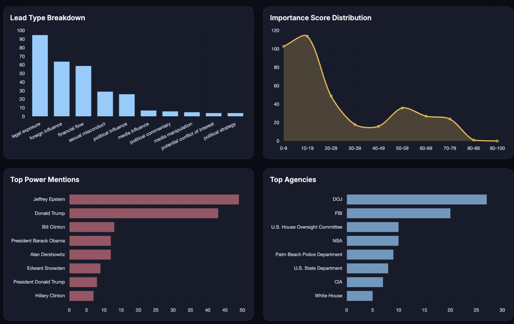
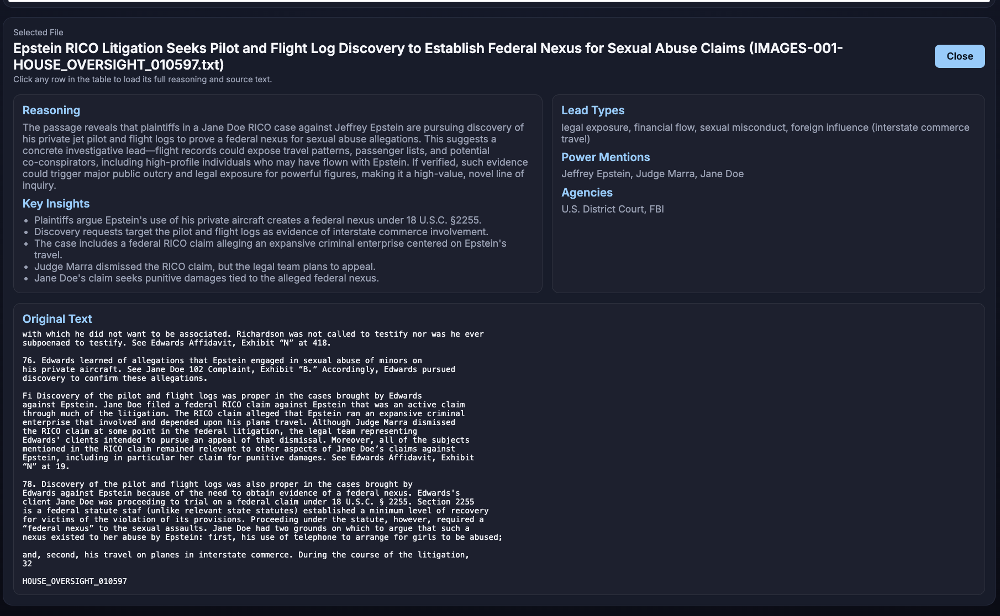

# Epstein Ranker

**Live Site: [https://epsteingate.org](https://epsteingate.org)**

LLM-powered tooling for triaging the **U.S. House Oversight Epstein Estate** document release.
This project:

1. Streams the document corpus through a locally hosted, open-source model (`qwen/qwen3-coder-next` running via **LM Studio**) to produce ranked, structured leads.
2. Ships a dashboard (`viewer/`) so investigators can filter, chart, and inspect every scored document (including the full source text) offline.

The entire workflow operates on a single MacBook Pro (M3 Max, 128 GB RAM). With an average draw of ~100 W, a 60-hour pass consumes ≈6 kWh (~$1.50 at SoCal off-peak rates) with zero cloud/API spend.

---

## Current Progress

**✓ All documents analyzed and scored**

The corpus contains ~25,800 documents from the House Oversight Committee release. As of now, the first 10,000 entries (rows 1–10,000) have been processed and are available in `contrib/epstein_ranked_*.jsonl` chunk files.

- **Completed:** Rows 1–10,000 (10 chunk files)
- **Contributors welcome:** See [Collaborative ranking workflow](#collaborative-ranking-workflow) below to help process the remaining documents

---

## Screenshots

| Table View | Insights & Charts |
| ---------- | ----------------- |
|  |  |

| Methodology Explainer |
| --------------------- |
|  |

---

## Data source & provenance

The repository’s base dataset is the **“20,000 Epstein Files”** text corpus prepared by [**tensonaut**](https://www.reddit.com/r/LocalLLaMA/comments/1ozu5v4/20000_epstein_files_in_a_single_text_file/), who OCR’d ~25,000 pages released by the U.S. House Committee on Oversight and Government Reform.  
Key references:

- Hugging Face dataset: <https://huggingface.co/datasets/tensonaut/EPSTEIN_FILES_20K>  
- Original release: [Oversight Committee Releases Additional Epstein Estate Documents (Nov 12, 2025)](https://oversight.house.gov/release/oversight-committee-releases-additional-epstein-estate-documents/)

**Corpus outline (summarized from the dataset card):**

- >25,000 plain-text documents derived from the committee’s Google Drive distribution.
- `TEXT/` files were converted directly from native text sources; `IMAGES/` files (≈20k JPGs) were OCR’d with Tesseract.
- Filenames preserve the source path so you can cross-reference with the official release.
- No manual edits beyond text extraction/OCR; expect OCR noise, redaction markers, or broken formatting.
- Legal status: documents originate from the House release and retain any original copyright. This repo asserts no ownership and offers no legal advice—ensure your use complies with applicable law.
- Content warning: expect references to sexual abuse, exploitation, trafficking, violence, and unverified allegations.

Huge thanks to **tensonaut** for the foundational OCR and dataset packaging; this project simply layers ranking and analytics on top.

---

## Requirements

- Python 3.9+
- `requests`
- LM Studio (or another local gateway) serving `qwen/qwen3-coder-next` locally at `http://localhost:5555/api/v1`
- The dataset CSV (`data/EPS_FILES_20K_NOV2026.csv`). **Not included in this repo**—download it from the Hugging Face link above and place it in `data/` (see `data/README.md` for instructions).

Install Python deps (only `requests` is needed):

```bash
python -m pip install -r requirements.txt  # or just: python -m pip install requests
```

---

## Running the ranker

```bash
cp ranker_config.example.toml ranker_config.toml  # optional defaults
python gpt_ranker.py \
  --input data/EPS_FILES_20K_NOV2026.csv \
  --output data/epstein_ranked.csv \
  --json-output data/epstein_ranked.jsonl \
  --endpoint http://localhost:5555/api/v1 \
  --api-format auto \
  --model qwen/qwen3-coder-next \
  --max-parallel-requests 4 \
  --resume \
  --sleep 0.5 \
  --config ranker_config.toml \
  --reasoning-effort low
```

By default, the ranker writes **1,000-row chunks** to `contrib/` and updates `data/chunks.json`.  
Set `--chunk-size 0` if you really want a single CSV/JSONL output (not recommended for sharing).

Notable flags:

- `--prompt-file`: specify a custom system prompt file (defaults to `prompts/default_system_prompt.txt`). See `prompts/README.md` for details on creating custom prompts.
- `--system-prompt`: provide an inline system prompt string (overrides `--prompt-file`).
- `--input`: accepts either the legacy CSV (`filename` + `text`) or a directory tree of `.txt` files.
- `--input-glob`: glob pattern used when `--input` is a directory (default `*.txt`, recursive).
- `--dataset-workspace-root` + `--dataset-tag`: isolate this corpus into its own workspace (`results/`, `chunks/`, `state/`, `metadata/`) so outputs do not mix with the oversight dataset.
- `--dataset-source-label`, `--dataset-source-url`, `--dataset-metadata-file`: attach provenance details; if `--run-metadata-file` is set (or auto-set in workspace mode), a run metadata JSON is written.
- `--resume`: skips rows already present in the JSONL/checkpoint so you can stop/restart long runs.
- `--checkpoint data/.epstein_checkpoint`: stores processed filenames to guard against duplication.
- `--reasoning-effort low/high`: trade accuracy for speed if your model exposes the reasoning control knob.
- `--max-parallel-requests`: number of concurrent requests to LM Studio (default `4`).
- `--api-format`: `auto` (default), `openai`, or `chat`. Use `chat` for LM Studio `/api/v1/chat` style endpoints.
- `--max-retries`, `--retry-backoff`: retry transient endpoint failures with exponential backoff.
- `--skip-low-quality` / `--no-skip-low-quality`: enable/disable pre-LLM filtering for empty/short/noisy OCR rows.
- `--min-text-chars`, `--min-text-words`, `--min-alpha-ratio`, `--min-unique-word-ratio`, `--max-repeated-char-run`: tune skip thresholds.
- `--justice-files-base-url`: base URL used to derive DOJ PDF links (stored as `source_pdf_url` and shown in the viewer).
- `--include-action-items`: opt-in if you want the LLM to list action items (off by default for brevity).
- `--timeout`: HTTP request timeout in seconds (default: 600 = 10 minutes). Increase for very large documents (100K+ tokens).
- `--max-rows N`: smoke-test on a small subset.
- `--list-models`: query your endpoint for available model IDs.
- `--rebuild-manifest`: scan `contrib/` for chunk files and rebuild `data/chunks.json` (useful if the manifest gets out of sync).
- `--start-row`, `--end-row`: process only a slice of the dataset (ideal for collaborative chunking).
- `--chunk-size`, `--chunk-dir`, `--chunk-manifest`: control chunk splitting, where chunk files live, and where the manifest is written.
- `--overwrite-output`: explicitly allow truncating existing files (default is to refuse unless `--resume` or unique paths are used).
- `--power-watts`, `--electric-rate`, `--run-hours`: plug in your local power draw/cost to estimate total electricity usage (also configurable via the TOML file).

Pause/resume behavior:

- Press `Ctrl+C` to pause gracefully.
- The ranker flushes completed rows, preserves the checkpoint, and exits with resume instructions.
- Restart with `--resume` to continue from where it left off.

Outputs:

- `contrib/epstein_ranked_<start>_<end>.jsonl` – Default chunked outputs (one file per 1,000 rows) that contain the headline, score, metadata, and original text for each document. Skipped files are retained with `processing_status=skipped` and `skip_reason`.
- `data/chunks.json` – Manifest listing all chunk files (the viewer uses this to load data).
- `data/epstein_ranked.csv/jsonl` – Only produced if you disable chunking via `--chunk-size 0`.
- `data/workspaces/<dataset-tag>/metadata/run_metadata.json` – Optional run provenance sidecar (enabled automatically in workspace mode).

### Independent Corpus Workspace

For large non-oversight corpora (like `data/new_data`), run in isolated workspace mode:

```bash
python gpt_ranker.py \
  --input data/new_data \
  --input-glob "*.txt" \
  --dataset-workspace-root data/workspaces \
  --dataset-tag standardworks_epstein_files \
  --dataset-source-label "StandardWorks Epstein Files" \
  --dataset-source-url "https://standardworks.ai/epstein-files" \
  --dataset-metadata-file data/dataset_profiles/standardworks_epstein_files.json \
  --max-parallel-requests 4 \
  --resume
```

This keeps outputs/checkpoints/chunks independent from the original `contrib/` + `data/chunks.json` workflow.
`data/workspaces/` is git-ignored by default.

### Chunk Manifest

The ranker automatically updates `data/chunks.json` after each chunk is completed. This manifest tells the viewer which chunk files exist and what row ranges they cover.

**If the manifest gets out of sync** (e.g., due to interrupted runs or manual file moves), you can rebuild it:

```bash
python gpt_ranker.py --rebuild-manifest
```

This scans `contrib/` for all chunk files and regenerates the manifest automatically.

---

## Customizing the system prompt

The ranker uses a system prompt to instruct the model on how to analyze and score documents. You can customize this prompt to fit your specific needs:

### Using a custom prompt file

1. Create your own prompt file in the `prompts/` directory (e.g., `prompts/my_custom_prompt.txt`)
2. Run the ranker with `--prompt-file`:

```bash
python gpt_ranker.py --prompt-file prompts/my_custom_prompt.txt --config ranker_config.toml
```

Or set it in your config file:

```toml
prompt_file = "prompts/my_custom_prompt.txt"
```

See `prompts/README.md` for detailed guidance on creating custom prompts, and check out `prompts/example_strict_scoring.txt` for an example of a stricter scoring methodology.

### Prompt priority

The ranker loads prompts in this order of priority:
1. `--system-prompt` (inline string argument)
2. `--prompt-file` or `prompt_file` in config
3. `prompts/default_system_prompt.txt` (if it exists)
4. Hardcoded default prompt (fallback)

### Tracking prompt usage

The prompt source is automatically included in the output metadata for each document, so you can always see which prompt was used for analysis.

---

## Scoring methodology (LLM prompt)

The default prompt instructs the model with the following criteria (excerpt):

```
You analyze primary documents related to court and investigative filings.
Focus on whether the passage offers potential leads—even if unverified—that connect influential actors ... to controversial actions, financial flows, or possible misconduct.
Score each passage on:
  1. Investigative usefulness
  2. Controversy / sensitivity
  3. Novelty
  4. Power linkage
Assign an importance_score from 0 (no meaningful lead) to 100 (blockbuster lead linking powerful actors to fresh controversy). Use the scale consistently:
  • 0–10  : noise, duplicates, previously published facts, or gossip with no actors.
  • 10–30 : low-value context; speculative or weak leads lacking specifics.
  • 30–50 : moderate leads with partial details or missing novelty.
  • 50–70 : strong leads with actionable info or notable controversy.
  • 70–85 : high-impact, new revelations tying powerful actors to clear misconduct.
  • 85–100: blockbuster revelations demanding immediate follow-up.
Reserve 70+ for claims that, if true, would represent major revelations or next-step investigations.
Return strict JSON with fields: headline, importance_score, reason, key_insights, tags, power_mentions, agency_involvement, lead_types.
```

Rows ≥70 typically surface multi-factor leads (named actors + money trail + novelty). Anything below ~30 is often speculation or previously reported context.

---

## Interactive viewer

Serve the dashboard to explore results, filter, and inspect the full source text of each document:

```bash
./viewer.sh 9000
# or manually:
cd viewer && python -m http.server 9000
```

Open <http://localhost:9000>. Features:

- Automatically loads any chunk listed in `data/chunks.json` (falls back to `data/epstein_ranked.jsonl` if no chunks exist).
- AG Grid table sorted by importance score (click a row to expand the detail drawer and read the entire document text).
- Filters for score threshold, lead types, power mentions, ad hoc search, and row limits.
- Charts showing lead-type distribution, score histogram, top power mentions, and top agencies.
- Methodology accordion describing the scoring criteria, prompt, and compute footprint.

`viewer/app.js` reads `data/chunks.json` by default, so remember to commit updated manifests + chunk files. If no manifest exists, it automatically scans for files named `contrib/epstein_ranked_*.jsonl` before falling back to `data/epstein_ranked.jsonl`.

---

## Collaborative ranking workflow

Want to help process more of the corpus? Fork the repo, claim a range of rows, and submit your results:

1. **Pick a chunk** – e.g., rows `00001–01000`, `01001–02000`, etc. Use whatever increments work. Announce the chunk (issue/Discord) so others don’t duplicate effort.
2. **Run the ranker on that slice** using the new range flags:

   ```bash
   python gpt_ranker.py \
     --config ranker_config.toml \
     --start-row 1001 \
     --end-row 2000 \
     --chunk-dir contrib \
     --chunk-manifest data/chunks.json \
     --known-json data/epstein_ranked.jsonl \
     --resume
   ```

   This only processes documents in that range, emits `contrib/epstein_ranked_<range>.jsonl`, and updates the manifest.  
   `--known-json` makes the script aware of previously merged results (so duplicates are skipped automatically). Combine with `--resume` if you need to pause and continue later.

3. **Export your outputs** – each run writes the chunk JSONL straight into `contrib/`. Keep the naming pattern `contrib/epstein_ranked_<start>_<end>.jsonl`.

4. **Submit a PR** with your chunk (the JSONL + updated `data/chunks.json`). We’ll merge the contributions into the global dataset and credit collaborators in the README.

Guidelines:

- Do **not** commit the original 100 MB source CSV; each contributor should download it separately.
- Keep the JSONL chunks intact (no reformatting) so we can merge them programmatically.
- If you discover inconsistencies or interesting leads, open an issue to coordinate follow-up analysis.
- Pull the latest `data/chunks.json` (and any merged JSONL files) before starting; pass the merged JSON via `--known-json` so you never duplicate work.

---

## Ethical considerations & intended use

- The corpus contains sensitive content (sexual abuse, trafficking, violence, unverified allegations). Use with care.
- Documents are part of the public record but may still be subject to copyright/privacy restrictions; verify before sharing or redistributing.
- Recommended use cases: investigative triage, exploratory data analysis, RAG/IR experiments, or academic review.
- This project does **not** assert any claims about the veracity of individual documents—scores merely prioritize leads for deeper human review.

---

## Acknowledgements

- **tensonaut** for compiling the OCR corpus and publishing it to Hugging Face.
- U.S. House Committee on Oversight and Government Reform for releasing the source documents.
- The LM Studio community & `r/LocalLLaMA` for pushing local LLM workflows forward.

---

## License

Released under the [MIT License](LICENSE). Please retain attribution to this project, the `tensonaut` dataset, and the U.S. House Oversight Committee release when building derivative tools or analyses.
